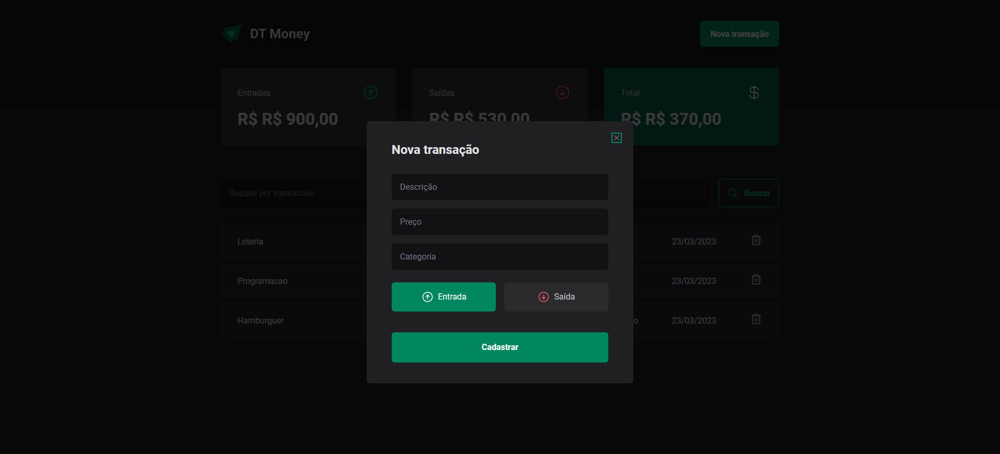

<h1 align="center" >DT Money</h1>

Aplicação para regular as transações de entrada e saída para controlar as finanças, com o título, o valor, a categoria e a data da transação.
<p>Foi feita com Typescript, Styled Components, React e algumas bibliotecas auxiliares como: React Hook Form, Date-fns, Immer, Zod, Phosphor e Radix.</p>

## Execução do projeto:

Para rodar o projeto, primeiro é necessário clonar o repositório e abrir em uma IDE, VSCode por exemplo.

```bash
# Clonar repositório
$ git clone https://github.com/Edusorrentino10/DT-Money-Atualizado.git
# Acessar pasta do projeto clonado
$ cd DT-Money-Atualizado

# Instalar dependências
$ npm install

# Executar aplicação
$ npm run dev

# Executar json server
$ npm run dev:server

# Abrir aplicação na porta 5173, acessando: http://localhost:5173
```

<!-- <h2 align="center"></h2> -->
<!-- <h2 align="center"></h2> -->




Feito por <a href="https://github.com/Edusorrentino10">Eduardo Sorrentino</a>.

Linkedin: https://linkedin.com/in/eduardo-sorrentino/